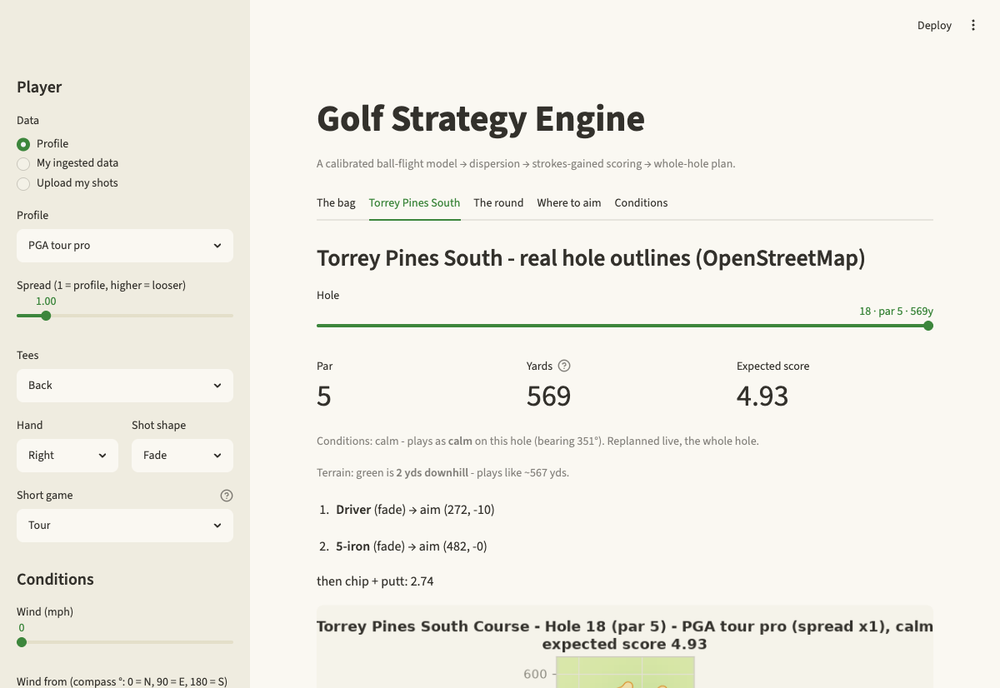
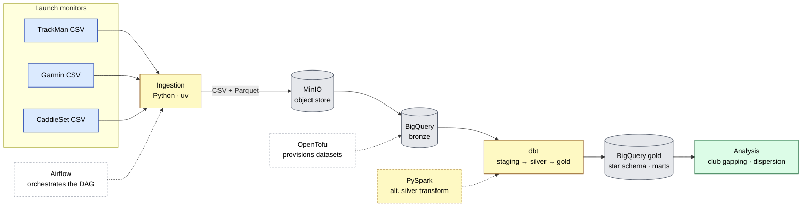
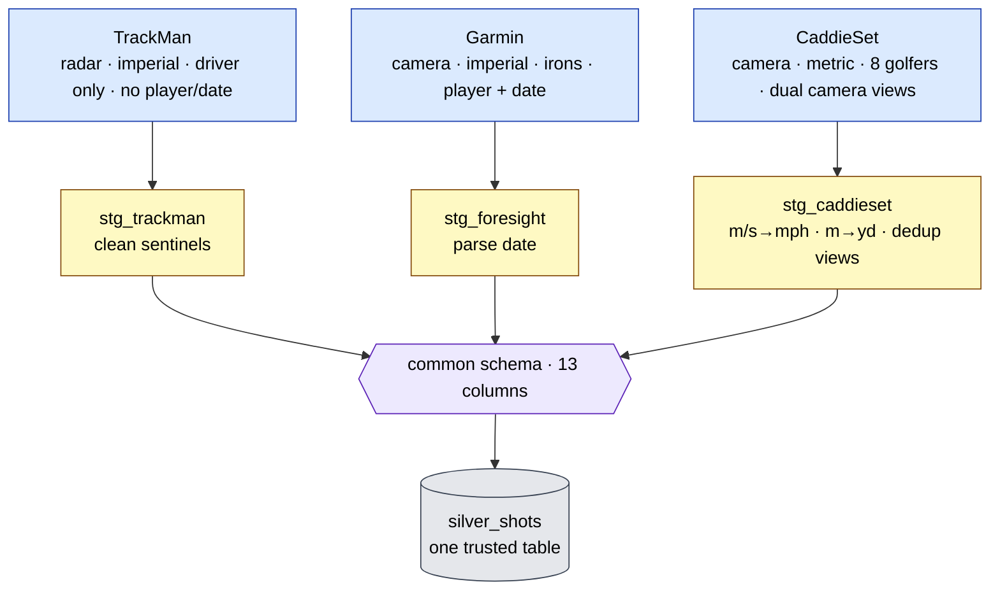
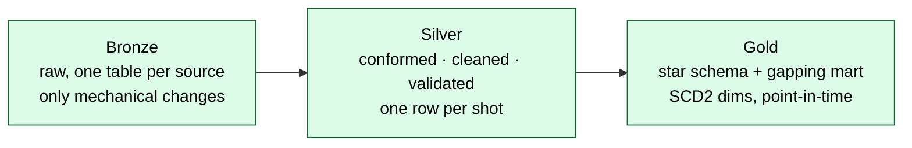
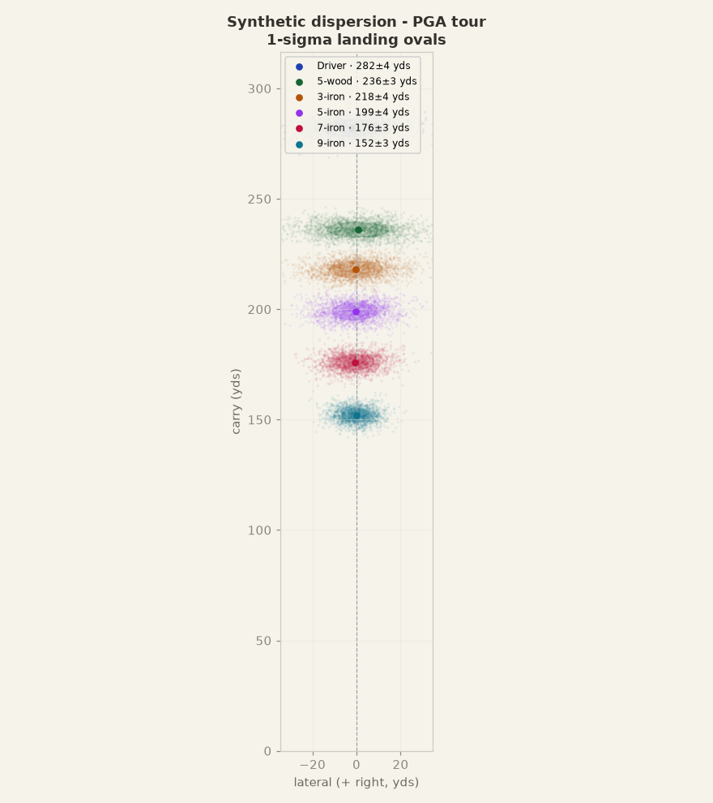
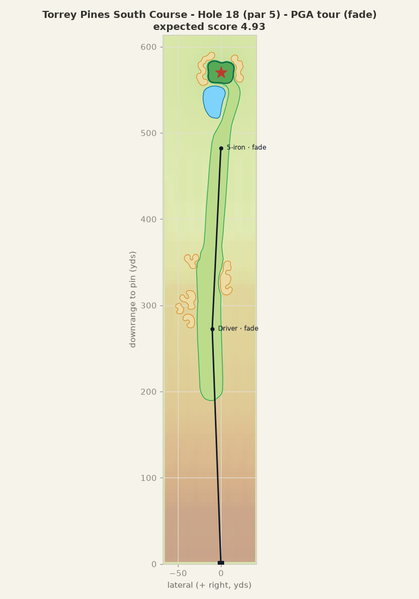
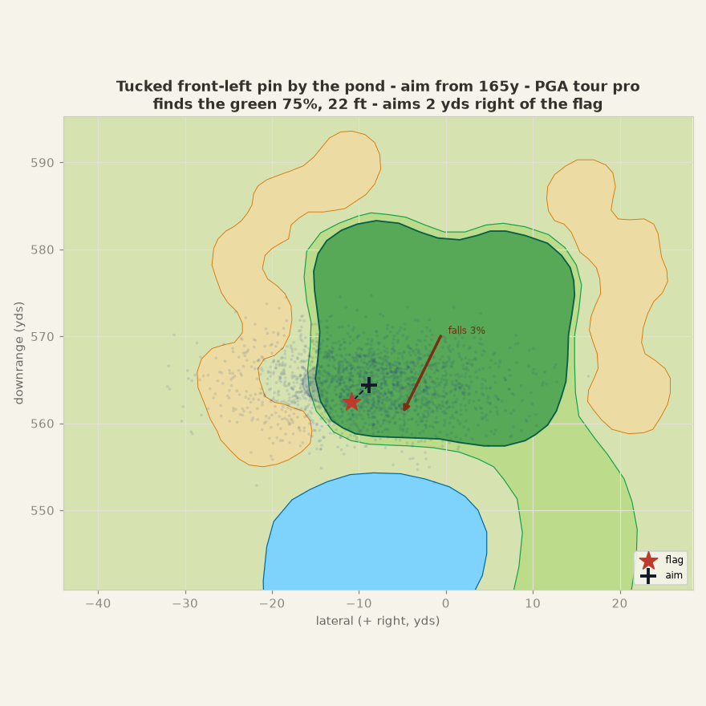

# Golf Launch-Monitor Data Pipeline

[](https://github.com/aImErYbArRaUlT/golf-pipeline/actions/workflows/ci.yml)
[](LICENSE)
[](https://www.python.org/downloads/release/python-3120/)

**A multi-source golf data pipeline and a physics-based shot-strategy engine.** It ingests
shot data from different launch monitors, **conforms** them into one common schema, and models
them into an analysis-ready star schema - then builds on that foundation to work out how to
play a real golf course: calibrated ball flight, shot dispersion, strokes-gained scoring, and
a whole-hole planner.

<p align="center">
  
</p>
<p align="center"><em>The interactive engine: pick a player, the tees, and conditions; it plans a real hole live - here Torrey Pines South's 18th, built from OpenStreetMap, with the strokes-gained shot sequence.</em></p>

The data side runs locally in Docker as a faithful simulation of a GCP / dbt / Airflow stack -
real BigQuery, real dbt, real Airflow, with MinIO standing in for cloud object storage and
OpenTofu provisioning the warehouse.

> Built end to end: ingestion, dbt models + tests, multi-source conforming, SCD2 history,
> Airflow orchestration, a PySpark silver transform, CI, and the strategy engine on top.

## Architecture



## The conforming idea (the interesting part)

A launch monitor's export is its own little world: TrackMan (radar) and
Foresight/Garmin and CaddieSet (camera) name their metrics differently, ship
different columns, and even use different units. Each source maps into **one
common schema** in its own dbt staging model - so the rest of the pipeline never
knows or cares which monitor a shot came from. Adding a launch monitor is a new
staging model plus a registry entry; nothing downstream changes.



The common schema, in full:

```
shot_id, source, player, club, session_date,
ball_speed_mph, club_speed_mph, smash_factor, launch_angle_deg,
spin_rate_rpm, carry_yards, total_yards, side_dispersion
```

## Medallion layers



- **Bronze** is raw. The only changes are mechanical: skip a source's units row,
  sanitize headers to snake_case (BigQuery needs it), add lineage columns.
- **Silver** is where conforming, unit conversion, dedup, and validation happen.
- **Gold** is a star schema - `fct_shots` (grain: one shot) with SCD2
  `dim_player` / `dim_club` / `dim_session` - plus an `agg_club_gapping` mart.

## Stack

- **Python 3.12** (uv) for ingestion · **dbt Core** (BigQuery) for transforms
- **BigQuery** (Sandbox - no billing) · **MinIO** for S3-compatible storage
- **Apache Airflow** orchestration · **PySpark** distributed silver transform
- **OpenTofu** for IaC · **just** as the command runner · **direnv** per-env context

## Prerequisites

- Docker, and a GCP project with BigQuery enabled (free Sandbox is fine)
- **Either** Nix (provides the whole toolchain - see below) **or** `uv`, `just`,
  OpenTofu and Node installed yourself
- Windows: use **WSL2**

## Setup

```sh
cp .env.example .env                  # set MINIO_ROOT_PASSWORD, GCP_PROJECT_ID
just install                          # python deps into a uv venv
just hooks                            # pre-commit hooks (incl. gitleaks)
just up                               # start MinIO

gcloud auth application-default login                     # sandbox auth (ADC)
cp infra/dev/terraform.tfvars.example infra/dev/terraform.tfvars
just infra-apply dev                  # create dev_bronze / dev_silver / dev_gold
```

With Nix + [nix-direnv], `cd` into the repo provisions the pinned toolchain
automatically; otherwise run `nix develop`. A `bigquery` MCP server (`.mcp.json`)
and project skills/agent (`.claude/`) ship with the repo.

## Running the pipeline

```sh
# manual, step by step
just ingest trackman dev              # CSV → Parquet → MinIO → dev_bronze
just ingest foresight dev
just ingest caddieset dev
just ingest-session shots.csv "Me" dev  # a personal launch-monitor session → bronze
just dbt-run dev                      # staging → silver → gold
just dbt-test dev                     # the data-quality gate

# or the whole thing via Airflow
just airflow-up                       # build + start Airflow (+ Postgres)
just dag-trigger                      # run the golf_pipeline DAG end to end

# or the distributed silver transform
just spark-silver                     # PySpark: bronze → conformed silver Parquet
```

See `just --list` for everything.

## Data sources

Real, publicly-posted launch-monitor exports - **four monitor types, ~13k
shots**. Some are single files; Garmin and FlightScope are whole GitHub
directories of per-session files, fetched and unioned by the ingestion loader.

| Source | Monitor | Origin | Notes |
|--------|---------|--------|-------|
| `trackman` | radar | [tim-blackmore/launch-monitor-regression](https://github.com/tim-blackmore/launch-monitor-regression) | ~10k driver shots, single file. Units row on line 2. |
| `foresight` | Garmin R10 | [jgamblin/golf](https://github.com/jgamblin/golf) | 14 session files, unioned (~1.8k shots). Real player/date/club; mixed 32/42-col schemas. |
| `caddieset` | camera | [damilab/CaddieSet](https://github.com/damilab/CaddieSet) (MIT) | **Metric**, 8 golfers, dual camera views per shot (~950 shots). |
| `flightscope` | FlightScope Mevo (doppler) | [sghill/golf](https://github.com/sghill/golf) | 20 per-club session files (~485 shots); date from the file path. |

CaddieSet is MIT; the others declare no license (treated as openly-posted sample
data, used here for a non-redistributed learning project).

## Data gaps and contributing data

The engine is honest about a real limitation: it is calibrated on tour *averages* and a
handful of openly-posted exports, not on broad shot-level data. Two consequences, both
visible in the code:

- **Dispersion below tour level is synthesised, not fit.** We have published tour means
  (per-club launch conditions and carry) but almost no real shot-to-shot *spread* across
  skill levels, so the sub-tour player profiles are generated from the calibrated physics
  model plus a skill knob (`modeling/synthetic.py`), not fit from data. Real multi-shot,
  full-bag sessions across a range of handicaps would let the dispersion model be measured
  rather than assumed.
- **Coverage is thin and skewed.** Of the ~13k real shots, most are a single TrackMan
  driver file; the other monitors contribute small, partial bags. More monitor types, more
  non-driver clubs, total-distance/roll for the sources that lack it, and on-course outcomes
  (where shots finished, putts holed) would sharpen the conforming layer, the roll model,
  and the scoring layer.

If you have launch-monitor data you are willing to share, it is genuinely welcome and would
directly improve the model: a TrackMan, Foresight/Garmin, FlightScope, or similar export,
ideally full-bag sessions with many shots per club. Send it to **aimery@barratec.com**.
Please only share data you own or are otherwise free to pass on, and strip any personal
details you would rather not include.

## Strategy engine (modeling core)

Gold answers "what happened"; the `modeling/` package starts answering "what
*would* happen". Stage A is a first-principles **ball-flight physics engine**: it
integrates the equations of motion under four forces - gravity, drag, Magnus lift
from backspin, and spin-axis tilt for draw/fade - from launch to landing
(`scipy.solve_ivp`). Given a shot's launch conditions it returns the full
trajectory plus carry, peak height, lateral offset, and descent angle.

The aerodynamic coefficients (drag `Cd`, spin-drag `Cd_spin`, lift `Cl`) are
**fit to real measured carry**, not guessed. `just calibrate` solves the inverse
problem against the **TrackMan PGA Tour bag** - 12 clubs spanning the full spin
range, which is what makes the spin-drag term identifiable (a single club can't).
One model reproduces every club's carry to **~3 yards** (driver through wedge).
It then runs an *independent* check against our own measured TrackMan driver
radar in `fct_shots` - carry it was never fit on - and reproduces it to **~9
yards**, before rendering a shot to `modeling/artifacts/trajectory.png`.

Stage B turns the deterministic engine **probabilistic**. Real shots scatter,
so a club lands in an oval, not a point. `just dispersion` estimates each club's
joint launch-condition distribution from its gold shots (mean + full covariance,
so correlations are kept), samples it, and flies the whole sample through a
**vectorised** RK4 integrator (`simulate_batch` - same four forces, thousands of
shots in lock-step), then summarises where the balls land: carry centre/spread
and the 1-sigma landing ellipse. It renders the player's bag as landing ovals to
`modeling/artifacts/dispersion.png`. The result self-validates: the **simulated
carry spread lands within a few yards of the spread the monitor itself reported**
for the same shots - the engine reproduces real shot-to-shot variance.

<p align="center">
  
</p>
<p align="center"><em>A synthetic tour bag flown through the engine - each club's 1-sigma landing oval, driver through 9-iron.</em></p>

Stage C adds the **value layer**: strokes-gained scoring. `expected_strokes
(distance, lie)` is the **published PGA-Tour benchmark** - the average strokes to
hole out by distance and lie, taken from Broadie's ShotLink work (*Assessing
Golfer Performance on the PGA TOUR* / *Every Shot Counts*): per-lie curves for
tee, fairway, rough, sand and recovery plus a putting curve, with verified
anchors (fairway 100yd = 2.80, rough 120yd = 3.08, a 0.23 penalty). `hole_out_
strokes` rolls that benchmark over a whole landing distribution to score a shot's
*expected* cost - the number the Stage-D optimiser minimises. `just scoring`
compares, for each club, expected strokes to hole out under the player's
**validated carry spread** against a tight low-handicap benchmark. On a loose
synthetic amateur bag (`just scoring amateur`, no warehouse needed) that gap is
about **+0.31 strokes per shot** left to distance inconsistency, and a tighter
bag closes it; it's scored on the carry dimension, with the 2-D shot shape and
lie waiting for Stage E's course geometry. It also runs on the real warehouse
bag with a bare `just scoring`.

Stages D-E are the **payoff: a shot-selection optimiser on a 2-D hole**. The hole
is real geometry - a green, a fairway corridor, and the trouble around it (a pond,
a bunker) as regions in the (downrange, lateral) plane. `just optimize` flies a
club's dispersion - now *both* its carry spread and its validated lateral spread -
and searches aim points (long/short **and** left/right) to minimise expected
strokes to hole out, charging a penalty stroke for any sampled ball in the water
and the right lie (green, fairway, rough, sand) for the rest. For a pin guarded by
a pond front-right it recommends clubbing down and aiming *left* of the flag,
beating a naive aim at it, and renders the hole with the recommended landing cloud
(`modeling/artifacts/hole.png`). The optimiser doesn't know the shapes - only
`lie_at` - so a richer course drops in underneath it unchanged.

Above the single shot, a **whole-hole grid-MDP planner** (`just plan`) plans the
full sequence tee-to-holed by value iteration, and it cashes in that seam on a
**real course**: `just course 18` plays **Torrey Pines South**, built from
OpenStreetMap green/fairway/bunker/water outlines (18 holes, par 72, ~7,700 yds),
the polygons dropping straight into the same `lie_at` interface. The action models
the **lie** you play from (rough/sand carry shorter and scatter wider, so the
fairway is worth aiming at), the player's **one stock shape** (a draw or fade bends
every shot the same way - the planner aims it, it doesn't flip draw/fade per shot,
which no golfer does), and keeps the **driver tee-only** - so the dogleg 18th plays
drive → iron lay-up short of the pond → wedge, not two bombed drivers up the
middle. It also carries **tee boxes** (OSM) and **elevation** (USGS terrain - the
ball flies to the landing *height*, so the cliffside downhill 3rd plays ~13 yds
shorter). **Playing conditions drive the whole plan, live** - a delta-model shifts
the cached dispersion for wind and air density in ~130 ms instead of re-running the
Monte-Carlo, so a 21 mph headwind visibly changes the strategy.

<p align="center">
  
</p>
<p align="center"><em>The whole-hole planner on Torrey Pines South's 18th: a drive, then a 5-iron lay-up short of the pond, for an expected 4.93 on the par 5 - every shot worked as the player's stock fade.</em></p>

A **cited benchmark layer** (`modeling/benchmarks/`, with `SOURCES.md`) holds
published reference numbers: the TrackMan PGA Tour averages (per-club launch
conditions + carry) and, in `scoring.py`, Broadie's strokes-gained baseline.
`just benchmark` shows the calibrated engine's carry against TrackMan's published
carry for every club. Building it paid off twice: it caught a real bug - a linear
lift coefficient *floating* a high-spin iron (lift ≈ gravity, a 5° descent), now
fixed with a physical `Cl` cap - and it showed a single driver-fit `Cd`
over-carried the bag by ~20 yards. That gap is closed by **spin-dependent drag**
(drag rises with spin) calibrated across the bag: one aerodynamic model now fits
driver-through-wedge to ~3 yards. A disposable scraper (`just collect-benchmarks
<url>`) pulls plain HTML tables to CSV for review; PDF/image tables (TrackMan's
graphic, Broadie's paper) are transcribed with a vision pass, as `SOURCES.md`
records.

```sh
just calibrate          # calibrate aero coeffs on the tour bag + radar check, plot
just synth pga tour     # a clean synthetic bag's dispersion (tour means + skill)
just dispersion         # per-club Monte-Carlo landing ovals + sim-vs-measured spread
just scoring amateur    # expected strokes per club vs a tight benchmark (or no arg for real)
just optimize           # best club + aim point on a 2-D hole (add tour/scratch)
just plan               # whole-hole MDP plan - shot sequence + value heatmap
just course 18          # plan a real Torrey Pines South hole from OSM outlines
just app                # interactive Streamlit app over the whole engine (no warehouse)
just benchmark          # validate engine carry against TrackMan's tour averages
just test-modeling      # physics / batch / calibration / dispersion / scoring / optimize
```

The engine takes a unit-normalised `ShotInput` (a contract decoupled from the
warehouse schema), so it stays independent of how any one monitor reports. The
batched integrator is cross-checked against the single-shot reference in the
tests, so dispersion flies exactly the physics that calibration validated.
`just app` puts all of it behind an interactive Streamlit surface - pick a **player
profile** (tour pro … senior), a **tee set** (back/middle/forward), a **short game**
level and conditions, and see the bag, **Torrey Pines South** replanned live *for that
player* under wind/altitude, **the whole round** (all 18 summed to a total vs par, with
the wind a fixed compass direction that helps some holes and hurts others), **where to
aim** an approach at a placed pin (anchored on your dispersion and the green's slope),
and what wind does to a shot - no warehouse needed. A senior needs three full shots to
reach the long 18th where a tour pro's third is a flicked wedge, and shoots ~103 off the
tips but ~96 from the forward tees; the same engine, a different person and a different tee.

Two things to read honestly here. The profiles are **distance-and-dispersion levels, not
handicaps**: the senior is amateur-level dispersion at ~74% of tour distance (a ~225-yard
driver), which is why 7,765 yards from the tips costs it ~30 strokes (the tour pro plays it
to ~+4, the mid-handicap to ~+16). And the engine plays each hole from its real geometry,
elevation, Broadie lie penalties, and measured green slope under the conditions you set - it
does **not** model a tournament setup (green speed and firmness, rough height, tucked
championship pins, narrowed fairways), and the round targets the green rather than a tucked
flag. So read the totals as one fixed, fairly firm difficulty: a casual member round at the
same tees would play several strokes easier, and a full championship setup harder. That
setup dial is a deliberate non-goal for now.

<p align="center">
  
</p>
<p align="center"><em>Approach aim at a tucked front-left pin by the pond: the engine nudges the aim right of the flag to avoid short-siding into the water - 75% to find the green, 22 ft, aiming 2 yds right.</em></p>

The app also runs on **real** data: beside the profiles it has an **Upload my shots**
mode (drop a raw TrackMan/Foresight/Garmin export - headers are conformed automatically)
and a **My ingested data** mode that lists the gold players a bag can be built for and
plans the course for the chosen one. Either way the bag is *theirs* - real per-club
dispersion flown from their own launch data, distances anchored to their measured
carries. `just ingest-session` persists a session through the medallion pipeline so it
becomes a permanent player; see [docs/strategy-engine.md](docs/strategy-engine.md).

## Project structure

```
ingestion/golf_ingest/   Python ingestion (CSV → Parquet → MinIO → bronze)
infra/                   OpenTofu - warehouse module + dev/uat/prod envs
dbt/                     dbt project (staging / silver / gold, seeds, tests)
modeling/                strategy engine - physics, dispersion, scoring, optimizer,
                         whole-hole planner, OSM courses, conditions, Streamlit app
airflow/                 DAG + image orchestrating the pipeline
spark/                   PySpark distributed silver transform
docs/                    architecture, data model, codebase tour, strategy engine
```

## Documentation

This README is the front door. For the deeper story, see [`docs/`](docs/):

- [Architecture](docs/architecture.md) - how a shot flows from CSV to gold, the
  medallion layers, and the three ways the pipeline runs.
- [Data model](docs/data-model.md) - the common schema, the conforming idea, and
  the gold star schema with its SCD2 dimensions and gapping mart.
- [Codebase tour](docs/codebase-tour.md) - a guided walk through the repo so you
  can find things and know what each part does.
- [Strategy engine](docs/strategy-engine.md) - the modeling layer: calibrated
  ball-flight physics, dispersion, strokes-gained scoring, and the 2-D optimizer.

## Design decisions

A few choices worth the why:

- **Source-agnostic conforming.** Each source conforms in its own staging model,
  so onboarding a launch monitor touches one registry entry and one model -
  nothing downstream. This is the project's spine.
- **Medallion, with a strict bronze.** Bronze stays faithful to the source;
  all renaming/units/cleaning happen in silver. You can always trace a gold
  number back to a raw row.
- **Idempotent loads.** Bronze loads with `WRITE_TRUNCATE`; dbt rebuilds models;
  Spark overwrites. Re-running never duplicates - safe under Airflow retries.
- **dbt tests are data contracts.** `not_null`/`unique` on `shot_id`, range
  checks on metrics, relationship tests on dims, and SCD2 invariants
  (no-overlap, exactly-one-current). They're the final quality gate, run last.
- **SCD2 + point-in-time.** `dim_player` / `dim_club` are effective-dated, so a
  shot attributes to the handicap and club setup as they were *on the session
  date* - not today's. Chosen over dbt snapshots because shots are historical.
- **IaC for parity, least privilege.** OpenTofu provisions per-env datasets; the
  service account grants `jobUser` project-wide but `dataEditor` scoped
  per-dataset. In Sandbox the SA is toggled off and auth is the developer's ADC -
  the SA stays in code as the documented production pattern.
- **Two silver implementations.** dbt (SQL) and PySpark produce the same silver
  row-for-row - the SQL path is the default; the Spark path demonstrates the
  distributed pattern and cross-validates the logic.
- **Physics calibrated to data, not assumed.** The modeling engine is
  first-principles (four forces, integrated), but its aerodynamic coefficients
  (drag, spin-drag, lift) are *fit to measured carry* - the TrackMan tour bag,
  which spans the spin range - and independently checked against our own driver
  radar. The model is grounded in real numbers, its error reported honestly
  rather than hidden. It reads only the gold contract, never a raw monitor schema.
- **Dispersion validated against the monitor.** Stage B's Monte-Carlo carry *and*
  lateral spread are checked against what the launch monitor reported for the same
  shots - they agree within a yard or two, so the engine demonstrably reproduces
  real scatter, in both the distance and the side dimensions.
- **Benchmarks validate, and find bugs.** Flying TrackMan's published tour launch
  numbers through the engine (`just benchmark`) surfaced two real flaws - a linear
  lift coefficient *floating* a high-spin iron (fixed with a physical `Cl` cap)
  and a single `Cd` over-carrying the bag (fixed with spin-dependent drag
  calibrated across the bag). Reference numbers are cited in
  `benchmarks/SOURCES.md`, not invented; the validation is an honest independent
  test, not a victory lap.
- **Scoring on validated quantities only.** Stage C's strokes-gained scoring
  leans on the carry dimension and leaves the 2-D shot shape and lie for Stage E's
  course geometry, anchoring distances to the monitor's measured means. A
  published-benchmark `expected_strokes` curve plus an honest scope beats a more
  ambitious score reaching past what the model supports.
- **A real benchmark, not invented numbers.** The expected-strokes baseline is
  the published PGA-Tour benchmark from Broadie's ShotLink research (8M+ shots,
  2003-2010), encoded as per-lie curves and cited in the source. Tests assert the
  values against verified anchors from that work, so the scoring rests on a known
  standard rather than plausible-looking constants.
- **Optimiser decoupled from the course.** The Stage-E optimiser talks to the
  hole only through `lie_at(x, y)` - green, fairway, rough, sand, water. The hole
  is rectangles today; a richer course (real polygons, elevation) drops in
  underneath without touching the search above. The same seam let the optimiser
  grow from a 1-D carry band to a 2-D hole without a rewrite.
- **AI with a human gate.** `just ai-map <source>` asks Claude to propose how a
  new monitor's columns map into the common schema (structured output, unit
  conversions, confidence). It's strictly advisory - the output is a draft a
  human reviews and confirms; the model never writes a model or touches the
  pipeline. AI used with guardrails, not blindly.

[nix-direnv]: https://github.com/nix-community/nix-direnv
