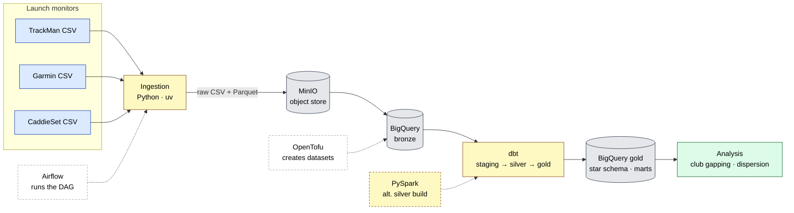
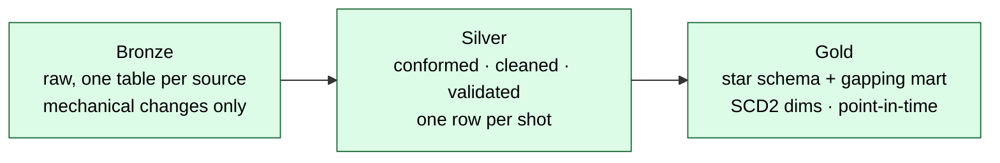
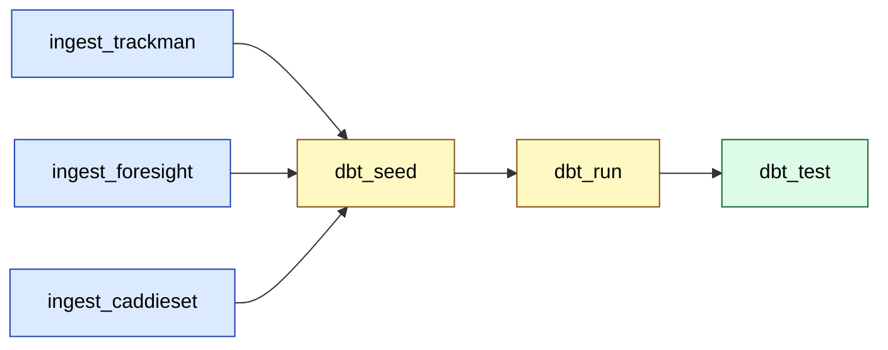

# Architecture

A golf launch monitor spits out a CSV of shots. That CSV is messy, source-
specific, and not comparable to the next monitor's CSV. This pipeline takes
those exports, lands them safely, conforms them into one shared shape, and
models them into tables you can actually analyse - all running locally in Docker
as a stand-in for a real cloud setup.

## The whole thing, end to end



Stage by stage:

- **Ingestion (Python).** Pulls a source's CSV, does the bare minimum to make it
  loadable (skip a units row, snake_case the headers, add lineage columns), and
  writes both the raw CSV and a Parquet copy to MinIO. Then it loads the Parquet
  into a per-source BigQuery **bronze** table.
- **MinIO** is a local S3. It stands in for cloud object storage so the code that
  talks to it (boto3) is identical to what you'd run against real S3.
- **BigQuery** is the warehouse. It runs in **Sandbox** mode - no billing, no
  card. Datasets are created by OpenTofu.
- **dbt** does the transformations: per-source **staging** models conform each
  export into the common schema, **silver** unifies them, and **gold** is the
  star schema plus a club-gapping mart.
- **Airflow, PySpark, OpenTofu** sit to the side: Airflow orchestrates the run,
  PySpark is an alternative (distributed) way to build silver, and OpenTofu
  provisions the warehouse.

Downstream of gold sits the **[strategy engine](strategy-engine.md)** - a
calibrated ball-flight model, Monte-Carlo dispersion, strokes-gained scoring, and
a shot-selection optimizer. It reads the gold contract and answers "what *would*
happen" and "what should I do", rather than just "what happened".

## Medallion layers

The data moves through three layers, each with a clear job. The rule of thumb:
**the further right, the more trustworthy and the more opinionated.**



- **Bronze is raw.** It mirrors the source. The only changes allowed are
  mechanical and non-negotiable for loading: drop the units row, snake_case the
  headers (BigQuery rejects spaces and dots), and add lineage (`_source`,
  `_row_index`, `_ingested_at_utc`). No renaming, no unit conversion. If a gold
  number ever looks wrong, you can trace it back to a real raw row.
- **Silver is where the work happens.** Each source's staging model renames
  columns, converts units, cleans bad values, and emits the common schema;
  `silver_shots` unions them into one trusted table, one row per shot.
- **Gold is for analysis.** A star schema (`fct_shots` plus dimensions) and an
  aggregate mart sit on top of silver.

See [data-model.md](data-model.md) for what actually lives in each layer.

## Three ways to run it

The same pipeline can be driven three ways. They all end up building the same
tables.

**1. By hand, with `just`.** The simplest path - run each step yourself. Good for
development and for understanding what each step does.

```sh
just ingest trackman dev   # CSV → Parquet → MinIO → bronze
just dbt-run dev           # staging → silver → gold
just dbt-test dev          # the data-quality gate
```

**2. With Airflow.** One DAG runs the whole thing: ingest every source in
parallel, then dbt seed → run → test, with the dbt test step as the final gate.
This is the "press one button" path.



```sh
just airflow-up    # build + start Airflow (+ Postgres)
just dag-trigger   # run the golf_pipeline DAG
```

Every step is idempotent - bronze loads with `WRITE_TRUNCATE`, dbt rebuilds from
scratch - so a retry or a re-run never duplicates data. That's what makes it safe
under Airflow's automatic retries.

**3. With PySpark.** The silver transform, done as a distributed job instead of
SQL. It reads the bronze Parquet from MinIO, conforms and dedups across all three
sources, and writes a unified silver Parquet back. At this data size Spark is
overkill - the point is to show the distributed pattern, and it cross-checks the
dbt logic (the two produce the same rows).

```sh
just spark-silver  # spark-submit the job in a container
```

## Environments and infrastructure

Everything is namespaced by environment so `dev`, `uat`, and `prod` never collide.

- **Datasets are `<env>_<layer>`** - `dev_bronze`, `dev_silver`, `dev_gold`. The
  active environment is `GOLF_ENV` (default `dev`).
- **OpenTofu** provisions the datasets. The resource logic lives in one reusable
  `warehouse` module; each environment (`infra/dev`, `infra/uat`, `infra/prod`)
  is a thin wrapper with its own state. Pointing an environment at its own GCP
  project later is a one-variable change.
- **direnv** sets the environment context automatically when you `cd` into an
  env directory.
- **Auth** in the sandbox is your own Application Default Credentials (ADC). A
  least-privilege service account is fully defined in the module but toggled off
  (SA keys need billing) - it stays in the code as the documented production
  pattern.

For the design *reasons* behind these choices, see the "Design decisions"
section of the top-level [README](../README.md).
