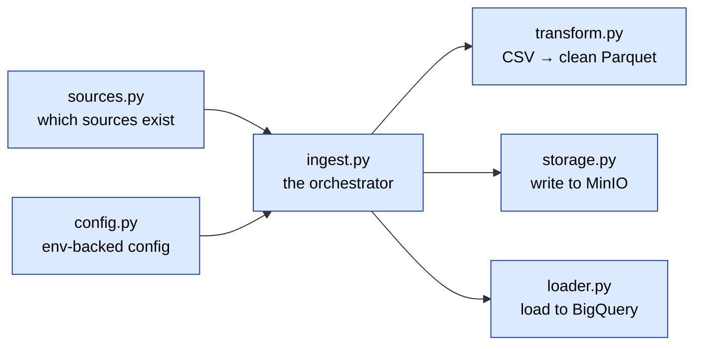

# Codebase tour

A guided walk through the repo so you can find things fast. The theme throughout
is **single responsibility** - small pieces that each do one job.

## The map

```
golf-pipeline/
├── ingestion/golf_ingest/   Python - pull a CSV, land it, load it to bronze
├── dbt/                     SQL transforms - staging / silver / gold, seeds, tests
├── infra/                   OpenTofu - BigQuery datasets, per environment
├── airflow/                 the DAG + its image
├── spark/                   the distributed silver job
├── tests/                   Python unit tests
├── docs/                    you are here
├── justfile                 every command you'll run
├── docker-compose.yml       MinIO, plus Airflow/Spark behind profiles
└── flake.nix                the pinned toolchain (Nix)
```

If you only read one file to understand how to *operate* the project, read the
`justfile` - it's the source of truth for every command.

## Ingestion - `ingestion/golf_ingest/`

A small Python package, split so each module touches one concern. Data flows
through them left to right:



| File | What it does |
|------|--------------|
| `config.py` | The **only** place that reads environment variables. Frozen dataclasses for MinIO and BigQuery config; fails loudly if a required var is missing. |
| `sources.py` | The **source registry**. Each launch monitor is one `Source(...)` entry - its URL, encoding, whether it has a units row, its bronze table name. Add a source here. |
| `transform.py` | Fetch the CSV, skip the units row, snake_case the headers, add lineage columns, write Parquet. The "make it loadable" step - nothing source-specific. |
| `storage.py` | Talk to MinIO over the S3 API (boto3). The same code would work against real S3. |
| `loader.py` | Load the Parquet into a bronze table with `WRITE_TRUNCATE` (idempotent - re-running replaces, never appends). |
| `ingest.py` | The CLI/orchestrator that wires the above together: `python -m golf_ingest.ingest --source trackman`. |
| `ai_mapping.py` | Phase 7 - asks Claude to *propose* how a new source's columns map into the common schema. Advisory only; a human reviews the draft. |

## dbt - `dbt/`

The transformation project. Models reference each other with `ref()`, so dbt
works out the build order itself.

```
dbt/
├── models/
│   ├── staging/    stg_trackman, stg_foresight, stg_caddieset (+ _staging.yml)
│   ├── silver/     silver_shots (+ _silver.yml)
│   └── gold/       fct_shots, dim_player, dim_club, dim_session,
│                   agg_club_gapping (+ _gold.yml)
├── seeds/          synthetic metadata: club_specs, player_clubs,
│                   player_profiles, session_manifest (+ _seeds.yml)
├── tests/          custom data tests (the SCD2 invariants, a range test)
├── macros/         generate_schema_name override (env-scoped datasets)
└── profiles.yml    BigQuery connection (OAuth/ADC - no keys)
```

How to read a layer:

- **staging** - one model per source, each conforming to the common schema. Start
  with `stg_caddieset.sql` if you want to see the interesting conversions.
- **silver** - `silver_shots.sql` is a short union of the staging models. Adding a
  source adds one `union all` here.
- **gold** - `fct_shots.sql` joins silver to the dimensions point-in-time;
  `dim_*.sql` build the SCD2 dimensions; `agg_club_gapping.sql` is the mart.

The `_*.yml` files next to the models hold the descriptions and the data tests.
That's where the contracts live.

## Infrastructure - `infra/`

```
infra/
├── modules/warehouse/   the reusable resource logic (datasets + optional SA)
├── dev/  uat/  prod/     one thin root module per environment, each with its
│                         own state and a committed .envrc (direnv)
```

The pattern: the `warehouse` module declares *what* to build (datasets named
`<env>_<layer>`, a least-privilege service account that's toggled off in the
sandbox); each environment directory calls it with its own variables. Provider
config and state are per-environment.

## Airflow - `airflow/`

- `Dockerfile` - extends the official Airflow image and installs dbt + the
  ingestion deps into a **separate venv**, so they can't clash with Airflow's own
  pinned dependencies.
- `dags/golf_pipeline_dag.py` - the DAG: ingest all sources in parallel, then dbt
  seed → run → test. It calls the same steps you'd run by hand.

Airflow and its Postgres live behind the `airflow` compose profile, so `just up`
still starts only MinIO; `just airflow-up` brings up the rest.

## Spark - `spark/`

`jobs/silver_transform.py` - a PySpark job that reads the bronze Parquet from
MinIO and rebuilds silver distributed: conform each source (including the metric
conversion and the camera-view dedup), union, validate, and write silver Parquet
back. It produces the same rows as the dbt silver - the two implementations
check each other.

## How do I…

**…run the whole thing?** `just airflow-up` then `just dag-trigger`. Or by hand:
`just ingest <source> dev`, `just dbt-run dev`, `just dbt-test dev`.

**…add a new launch monitor?** Four steps, and only the first two are code:

1. Add a `Source(...)` entry to `sources.py`.
2. `just ingest <name> dev` to land it in bronze.
3. Add `stg_<name>.sql` mapping its columns into the common schema.
4. Union it into `silver_shots` and confirm the tests still pass.

(There's an `add-source` skill in `.claude/skills/` that walks through exactly
this.)

**…change which environment I'm targeting?** Set `GOLF_ENV` (or `cd` into an
`infra/<env>` directory and let direnv do it). Datasets follow as `<env>_*`.

**…find where secrets/config come from?** `config.py` and `.env`. Nothing is
hardcoded - every credential is read from the environment, and `.env` is
gitignored. `gitleaks` runs as a pre-commit hook to keep it that way.

**…run the checks?** `just test` (Python), `just dbt-test dev` (data contracts),
`just check` (all the pre-commit hooks). CI runs the lint + unit tests + a dbt
parse on every PR.
