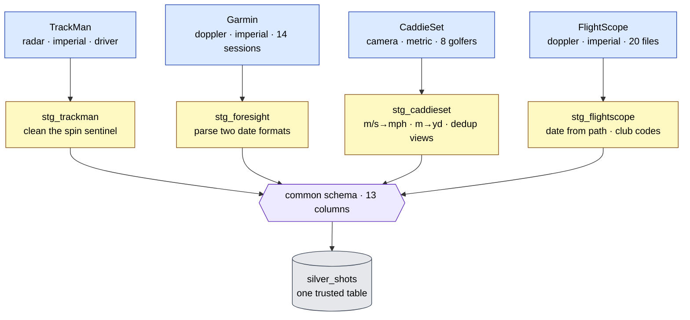
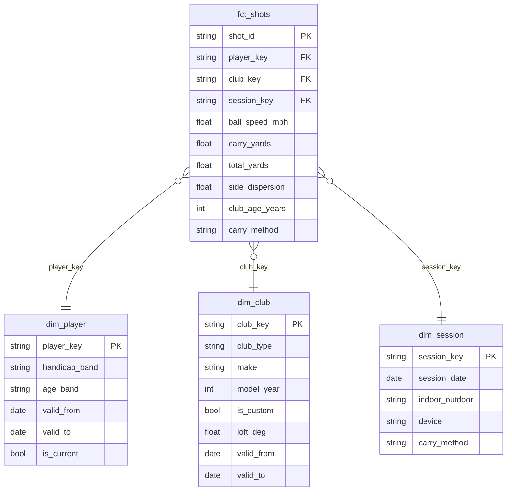

# Data model

This is what the data looks like as it moves through the layers - from three
incompatible CSVs to one star schema you can slice by player, club, and session.

## The common schema (the contract)

Every source, no matter how different, is mapped into exactly this set of columns
in its staging model:

```
shot_id, source, player, club, session_date,
ball_speed_mph, club_speed_mph, smash_factor, launch_angle_deg,
spin_rate_rpm, carry_yards, total_yards, side_dispersion,
spin_axis_deg, launch_direction_deg
```

(`spin_axis_deg` and `launch_direction_deg` describe shot *shape* - the inputs
the strategy engine's physics needs for draw/fade and left/right dispersion.
Present for radar/camera sources; null for FlightScope, which doesn't report them.)

Speeds are mph, distances are yards, angles are degrees, spin is rpm. `shot_id`
is a stable surrogate key (`md5(source + row index)`), so re-ingesting the same
file produces the same ids - that's what keeps loads idempotent.

This fixed shape is the whole trick. Everything downstream of staging only ever
sees these columns, so it never has to know or care which monitor a shot came
from.

## The conforming idea

The four sources are genuinely different - different column names, different
units, different coverage, even different file layouts:

| Source | Type | Units | Quirks |
|--------|------|-------|--------|
| TrackMan | radar | imperial | one file, driver-only, no player or date, a units row, a missing-data sentinel |
| Garmin (Foresight) | doppler | imperial | 14 session files (mixed 32/42-col schemas), real player/date/club, a units row, a UTF-8 BOM, two timestamp formats |
| CaddieSet | camera | **metric** | 8 golfers, each shot recorded twice (two camera angles), no club speed |
| FlightScope | doppler | imperial | 20 per-club session files, club codes (`6I`), the date in the file path, no total/dispersion |

Each one gets its own staging model that knows how to translate *that* source -
and only that source - into the common schema. Adding the fifth monitor is a new
staging model plus a registry entry. Nothing else changes.

> Single-file sources land directly; multi-file sources (Garmin, FlightScope)
> are whole GitHub directories - the ingestion loader lists the files, fetches
> each, and unions them, tolerating the column differences between sessions.



The CaddieSet staging model is the one that does real work: it converts metric to
imperial (m/s → mph, metres → yards), derives total spin from the back/side spin
components, and dedups the two camera-view rows down to one shot. If you want to
see what "conforming" means concretely, read `dbt/models/staging/stg_caddieset.sql`.

## Bronze → silver → gold

### Bronze

One table per source (`trackman_raw`, `foresight_raw`, `caddieset_raw`), landed
by the ingestion job. Raw column values, every cell a string, plus lineage
columns. Nothing is renamed or converted here.

### Silver

`silver_shots` is the union of the staging models - one row per shot, common
schema, cleaned and validated. This is the single trusted shot table everything
else is built from.

### Gold - the star schema

Gold is a classic star: one fact table at the grain of a single shot, surrounded
by dimensions that describe the player, the club, and the session.



### Slowly-changing dimensions (SCD2) and point-in-time joins

`dim_player` and `dim_club` are **SCD Type 2** - each row is a version with a
validity window (`valid_from`, `valid_to`, `is_current`). A player's handicap
changes over time; their clubs change too. So when `fct_shots` attaches the
player and club to a shot, it joins on the version that was valid **at the
session date** - not today's version. A shot from 2024 attributes to the 2024
handicap.

That's the difference between "Golfer 1 is a 9-handicap" and "Golfer 1 was a
12-handicap when they hit this shot, and an 9 by the time they hit that one." The
fact table gets it right per shot.

`dim_club` is also **enriched**: it joins player-reported clubs against a
`club_specs` reference (make/model/year → stock loft, length, shaft). Custom
clubs (bent loft, aftermarket shaft) fall back to the player's reported specs
instead of the stock reference.

`dim_session` carries a **`carry_method`** flag - `measured` (radar/camera) vs
`estimated` (consumer monitor) - so you don't accidentally compare an outdoor
radar carry against an indoor estimate.

> The metadata behind the dimensions (player profiles, club specs, session
> context) comes from four small **seed** files under `dbt/seeds/`. They're
> synthetic for now; in a real deployment they'd be fed by a short player/club
> profile form. The model is built to be populated either way.

### The club-gapping mart

`agg_club_gapping` is the table a golfer actually wants. It aggregates
`fct_shots` to one row per (source, player, club) and reports the numbers that
matter for picking a club:

- **median carry** (leads, because range mishits drag the average around)
- a p10-p90 spread band and a consistency standard deviation
- **the gap in median carry to the next-shorter club** - the literal "gapping"
- typical miss distance and direction bias
- the shot count, so you know which numbers to trust

## Tests are the contract

dbt tests aren't an afterthought - they're how the pipeline proves it's correct,
and they run as the final gate. There are 72 of them. The kinds:

- `not_null` + `unique` on every `shot_id` and surrogate key
- `accepted_values` on `source` and `carry_method`
- range checks on the metrics (a `between` test catches a 64° launch angle and a
  missing-data sentinel)
- relationship tests from `fct_shots` to each dimension (no orphan keys)
- SCD2 invariants: no overlapping validity windows, exactly one current version
  per entity

If a contract fails, the run fails. That's the point.
