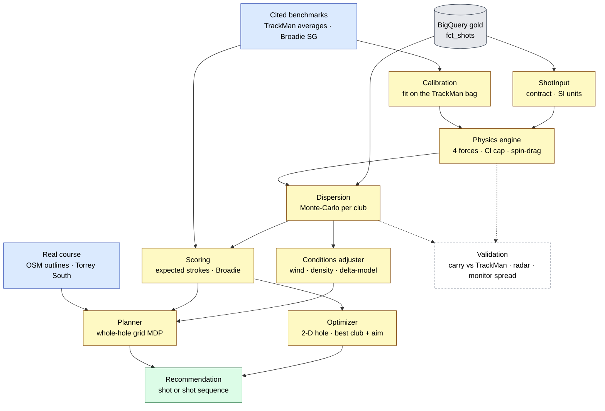

# Strategy engine

Gold tells you **what happened** - every shot, conformed and modelled. The
strategy engine (`modeling/`) is the layer on top that answers **what *would*
happen** and **what should I do**. It takes a shot's launch conditions, flies a
first-principles ball-flight model, learns how real clubs scatter, prices the
outcome in strokes, and recommends a club and an aim point on a hole.

It is deliberately decoupled from the warehouse: it reads one documented contract
(`ShotInput`), never a raw monitor schema, so nothing here changes when a new
launch monitor is onboarded.

## The whole engine, end to end



## Stage by stage

- **Contract (`contracts.py`).** A frozen `ShotInput` in SI units, plus a thin
  mapper from a gold `fct_shots` row. The physics never sees mph, degrees or rpm -
  only this contract - so it stays independent of any monitor.
- **Physics (`physics.py`).** Integrates the equations of motion under four forces
  - gravity, drag, Magnus lift from backspin, and spin-axis tilt for draw/fade -
  from launch to landing (`scipy.solve_ivp`). Two refinements keep it honest at the
  edges: the lift coefficient is **capped** at a physical ceiling (a real ball
  can't gain unbounded lift; without the cap a high-spin iron *floats*), and **drag
  rises with spin** (`Cd = cd + cd_spin · spin_ratio`), the effect that separates a
  low-spin driver from a high-spin wedge. A batched RK4 (`simulate_batch`) flies
  thousands of shots in lock-step for Monte-Carlo, cross-checked against the
  single-shot reference. It also models **conditions** (`conditions.py`: wind as
  air-relative velocity, air density from temperature/altitude) and **roll**
  (`roll_yards`: total = carry + a spin-driven release, so a driver runs out and a
  wedge checks up - anchored to tour roll figures).
- **Calibration (`calibration.py`, `benchmarks/`).** The three aerodynamic
  coefficients are *fit*, not guessed - against the **TrackMan PGA Tour bag**, 12
  clubs spanning the full spin range (which is what makes the spin-drag term
  identifiable). One model reproduces every club's carry to ~3 yards. It is then
  checked **out-of-sample** against our own measured TrackMan driver radar in the
  warehouse (~9 yards) - carry it was never fit on.
- **Dispersion (`dispersion.py`).** Real shots scatter, so a club lands in an oval,
  not a point. For each club it fits a joint launch-condition distribution from the
  gold shots (mean + full covariance, keeping correlations), samples it, and flies
  the sample through the calibrated engine. The result self-validates: simulated
  carry **and** lateral spread land within a yard or two of what the monitor itself
  reported for the same shots.
- **Scoring (`scoring.py`).** The value layer. `expected_strokes(distance, lie)` is
  the published PGA-Tour benchmark (Broadie's ShotLink work) - per-lie curves for
  tee, fairway, rough, sand, recovery, plus a putting curve. Rolling it over a
  landing distribution prices a shot's *expected* cost to hole out: the number the
  optimizer minimises. A `short_game` factor makes it *the player's* short game and
  putting rather than the tour benchmark: it scales the strokes needed above holing
  the next one (`base + short_game·weight·(base - 1)`), so a tap-in barely moves while
  a long putt or a bunker shot is taxed. The weight is heavier off the green than on
  it (the amateur-to-tour gap is larger per shot around the green than putting), which
  also means a missed green costs more than a putt - so a weaker short game leans the
  aim onto the fat of the green, not only inflates the score. The full swing is owned
  by the bag's dispersion; this curve is only evaluated near the green, so it stays
  the around-and-on-the-green skill it models.
- **Optimizer + course (`optimize.py`, `course.py`).** The payoff. The hole is 2-D
  geometry - a green, a fairway corridor, water and bunkers as regions in the
  (downrange, lateral) plane. The optimizer flies a club's dispersion in *both*
  validated dimensions and searches aim points (long/short **and** left/right) to
  minimise expected strokes - a penalty for water, the right lie for everything
  else. For a pin guarded by a pond it clubs down and aims away from the trouble.
  It couples to the hole only through `lie_at`, so richer geometry drops in
  underneath unchanged.
- **Whole-hole planner (`planner.py`).** The single-shot optimiser picks the best
  *next* shot; the planner plans the whole hole as a 2-D grid MDP. The value of a
  cell is the expected strokes to hole out under optimal play, found by value
  iteration: `V(s) = min over (club, aim) of [1 + E_landing V(s')]`. The trick that
  makes it fast (a hole solves in well under a second) is that a club's expected
  value of aiming at *every* cell at once is one 2-D correlation of the value grid
  with that shot's landing stencil; aiming is a shift; the short game inside the
  shortest club is a baseline floor. The recommended shot sequence is the rollout
  of the policy from the tee, and it matches the single-shot optimiser on a
  one-shot hole. The grid is geometry-agnostic - it asks the hole only for
  `bounds`, `lie_at`, `remaining`, `in_penalty` - so it plans a rectangle test hole
  and a real course (below) with the same value iteration. The action isn't just
  *club + aim*: it models the **lie** you play from (a shot from rough/sand carries
  shorter and scatters wider, so the fairway is worth aiming at), the player's **one
  stock shape** (a draw or fade bends *every* shot the same way and skews the bad
  miss - the planner aims that shape, it doesn't flip draw/fade per shot, because
  real golfers don't move the ball both ways off the tee), and keeps the **driver
  tee-only** (off the deck it lays up). So a dogleg par 5 plays drive → iron lay-up
  short of the water → wedge, not two bombed drivers up the middle.
  Ground outside a hole's **playable corridor** (its fairways, green, and a buffer
  along the mapped route) is a **recovery lie** - trees/junk you can fly over but
  can't safely land in. That one addition makes the planner *route doglegs*: rather
  than fire the straight tee→pin line through the corner, it aims around it - and
  cuts the corner only when the player's carry and dispersion clear the trouble, so
  a bomber goes for it, a short hitter lays to the corner, and a wild long hitter
  pays for the same line in expected strokes. The corridor is supplied by the
  course data (a hole with none plays as before).

## Honest validation

The engine is checked against numbers it didn't fit, and the gaps are stated, not
hidden:

| Check | Result |
|-------|--------|
| Whole-bag carry vs TrackMan averages (in-sample fit) | ~3 yds MAE, driver → wedge |
| Driver carry vs measured radar (out-of-sample) | ~9 yds MAE |
| Same model on the LPGA bag | ~2 yds MAE |
| Dispersion carry σ vs monitor-reported σ | within ~2 yds |
| Dispersion lateral σ vs monitor side dispersion | within ~2 yds |

Building the benchmark layer paid for itself: it caught a real bug (the lift
*float*) and a real bias (one global `Cd` over-carrying the bag), both since fixed.

## Synthetic data

The real data is either tour *averages* (means only) or one wildly inconsistent
amateur, so the demos either can't show a spread or look muddy. `synthetic.py`
fills the gap: it takes a tour club's mean launch conditions and scatters them by
a **skill level** (`TOUR`/`SCRATCH`/`AMATEUR`, or a single `consistency` knob),
then flies them through the calibrated engine. The spreads are heuristic
(published consistency figures), so the knob is explicit and honest. The result is
a `ClubBag` interchangeable with the real one - so `just synth`, the optimizer
(`just optimize tour`), the planner and the app all run on clean data, with no
warehouse.

## Personalized players

The planner plans for a `ClubBag` - it doesn't care whose. A tour pro and a senior
are just different bags (different distances and dispersion), so they get different
optimal ways round the same hole. `players.py` scales the tour bag by swing speed
into named **profiles** (tour pro → long amateur → mid → senior): the pro flies a
wedge into the par-5 18th (~4.7); the senior, who carries the driver ~209, plays
Driver → hybrid → 5-wood (~6.1) and shoots ~94 off the championship tees - which is
exactly why **tee boxes** matter (move them to the forward tees and the senior
shoots ~88). This is the synthetic, illustrative path.

A **real** player's bag comes from their own ingested shots - the same `ClubBag`, the
same planner - which is where the data pipeline and the engine join into a personal
caddie. `players.bag_from_shots` builds it from common-schema rows (an uploaded CSV or
gold `fct_shots`): each club with ≥8 clean shots gets the dispersion the engine flies
from *their* launch conditions, the rest gap-fill from the tour bag scaled to their
distances (flagged inferred). Two things keep it honest. Real logs are full of duds -
whiffs, tops, warm-ups - so each club is **trimmed** to ball speeds within ±30% of its
median before the fit. And the cloud is **anchored to the player's measured carry**:
the physics gives the dispersion shape, the monitor gives the truth of how far they
hit it, so a 7-iron reads *their* number, not the engine's. `players.bag_from_warehouse`
+ `warehouse.list_player_bags`/`fetch_player_rows` are the warehouse seam, surfaced in
the app as a **My ingested data** mode that lists the gold players a bag can be built
for and plans the course for the chosen one. The numbers are only as good as the data:
the engine's simulated dispersion matches the monitor's measured spread within a yard
or two (the accuracy proof), so noisy or partial-swing input yields honestly wide
numbers - the app flags the measured consistency rather than feigning precision.
Camera-only sources with no launch data (e.g. CaddieSet) can't drive the physics and
drop out of the menu.

Getting a session in is easy either way. The upload path conforms raw export headers
(`players.conform_export` maps "Ball Speed", "Carry", "Spin Rate" … to the common
schema), so a player drags their own TrackMan/Foresight/Garmin/GSPro CSV straight in -
no column renaming. To *persist* a session as a permanent player, `just ingest-session
<file> <player>` (`modeling/ingest_session.py`) conforms the file, stamps the player,
and lands it in `<env>_bronze.manual_raw` through the same medallion pipeline every
source uses; `stg_manual` types it like any other staging model (and tolerates a
missing table, so `dbt run` is unaffected until a session exists). After `just dbt-run`
it's a player in gold and in the app's **My ingested data** menu. The "manual" source
is one bronze table with `WRITE_TRUNCATE`, so it holds one personal session at a time
(re-ingesting replaces it).

A bag captures the full swing but not the **short game**, so that is a separate skill
(`players.SHORT_GAME_LEVELS`, Tour → Loose) threaded into the planner and the aim as
the `short_game` factor above. It is the other half of a score: on Torrey a loose
short game adds ~5 strokes over a tour one to the same bag, and it changes the *plan*
- a player who can't get up and down lays up to a full wedge instead of going for a
par 5. Each profile carries a default level; an upload sets it explicitly (the data
can't infer it). Bag builds are memoized (`synthetic.py`, and the one-time
`calibrate_engine` fit), so toggling a profile or replanning is instant after the
first build of each.

## Real courses

The planner plays an actual course, not just a rectangle. `courses/build.py` turns
an **OpenStreetMap** golf course - lat/lon green/fairway/bunker/water polygons and
hole centrelines carrying par - into a committed JSON of holes projected into the
engine's `(downrange, lateral)` yard frame: each hole oriented along its tee→pin
line, the pin on the downrange axis. **Torrey Pines South** ships built in (18
holes, par 72, ~7,700 yds off the championship tees; the famous 18th pond
included). `course.CourseHole` is the polygon counterpart of the rectangle `Hole`
with the same interface, classifying lie by polygon membership (green > sand >
fairway > rough). Because the planner only speaks that interface, real outlines
slot in with no change to the value iteration - the seam the optimizer was built
on. Provenance and the Overpass query are in `courses/SOURCES.md` (OSM, ODbL).

The builder also pulls each hole's **tee boxes** from the OSM tee polygons; a
forward tee sits further downrange, so it plays shorter (Torrey South: ~7,700 yds
off the back, ~6,900 forward - the real tee sets). `plan_hole` takes a tee start -
value iteration computes every cell regardless, so the tee just picks where the
rollout begins and where the driver is legal. So the app's Back / Middle / Forward
selector replans the whole round at the chosen yardages.

And it carries **elevation**: the builder samples each hole's terrain from the USGS
National Map (a read-only `.gov` point service; the numbers are committed so the
runtime stays offline) into a downrange profile. The physics flies to the target's
*height*, not flat ground - uphill catches the ball earlier (shorter), downhill
later (longer) - and the planner turns each club's flat carry into a per-row field
corrected for the elevation change to the landing zone (~0.93 yds per yd; one
factor fits the bag, since every club descends ~47°). A flat hole gives a constant
field and the fast path, so nothing else changes. Torrey's cliffside 3rd plays ~13
yds downhill (so it plays easier); the app shows each hole's "plays-like" yardage.

## Playing conditions, live

Wind and air density change *where* the bag lands, and we want that to drive the
**whole plan**, fast enough for a slider. Re-running the Monte-Carlo under each
new wind would take seconds; instead `conditions.adjust_bag_for_conditions` uses a
**delta-model**: the cached cloud already holds a club's spread, and conditions
mostly *translate* its centre, so each club's whole cloud is shifted by how its
stock shot's landing moves calm → conditions - two vectorised stock flights, ~130
ms for the bag. Re-plan on top and a 21 mph headwind turns Torrey's reachable par-5
18th into a three-shotter in well under a second. Exact for the mean; the
second-order change in spread is neglected (stated, not hidden).

Across the **round**, the wind is a single *compass* direction resolved into each
hole's frame from its stored tee→pin bearing (`conditions.relative_wind`) - so one
wind is a headwind on the holes you play into it and a tailwind coming back. A 20
mph southerly nets only ~+1.4 on a tour round (into-wind holes offset by downwind
ones), not a fantasy "all into it."

## Run it

```sh
just calibrate    # fit aero coeffs on the tour bag + the radar check, plot a shot
just synth pga tour   # a clean synthetic bag's dispersion (no warehouse)
just dispersion   # per-club Monte-Carlo landing ovals + sim-vs-measured spread
just scoring amateur  # expected strokes per club vs a benchmark (or no arg for real)
just optimize     # best club + aim point on a 2-D hole (add tour/scratch for synthetic)
just plan         # whole-hole MDP plan - shot sequence + value heatmap
just course 18    # plan a real Torrey Pines South hole, render its OSM outline
just benchmark    # the calibrated engine's carry vs TrackMan, whole bag
just app          # interactive Streamlit app over the whole engine (no warehouse)
just test-modeling
```

A **where-to-aim** view turns the same dispersion into a caddie number: it flies a
club's landing cloud at a grid of targets around a placed pin, prices each by
expected strokes to hole out, and returns the strokes-gained-optimal aim as plain
yards short/long and left/right of the flag - so a tight player fires at it, a wide
player or a pin tucked by the water gets walked to the fat side (`aim.aim_for_pin`).
The pin is clamped onto the putting surface (a flag never sits off the green), and
each green carries a **slope** fit from USGS (`green_slope`, ~2-4% at Torrey, mostly
back-to-front): being above the hole is a downhill putt and costs more, so the aim
is pulled **below the hole** to leave the more makeable uphill putt. So a back pin
on a front-falling green plays short, not at the flag.

`just app` is the interactive surface (Stage F): a **player profile** (tour pro …
senior) or an uploaded bag, a **tee set** (back/middle/forward), a **short game**
level, a stock shape, conditions, and five real-course
tabs - the bag's dispersion, **Torrey Pines South**
(real hole outlines, replanned live under the sidebar conditions), **the whole
round** (all 18 holes summed to a predicted total vs par), **where to aim** a given
approach at a placed pin, and what wind and altitude do to one shot. It runs
entirely on the synthetic generator, so it needs no warehouse or credentials.

Artifacts render to `modeling/artifacts/` (gitignored). Reference numbers and how
they were collected are in `modeling/benchmarks/SOURCES.md`.

## Seams left open

- **Course geometry - now realised.** The rectangle hazards were always a seam:
  the planner asks only `lie_at`/`bounds`/`remaining`/`in_penalty`, so real OSM
  polygons (Torrey Pines South), tee boxes and USGS elevation all dropped in with no
  change to the search. Per-shot lie effects (a downhill *lie*, a flier from rough)
  and lateral terrain slope are the next refinements through the same seam.
- **Conditions on the cloud's shape.** The delta-model translates each landing
  cloud for wind/density but keeps its spread; in reality a strong wind also
  *stretches* dispersion. Fitting a per-club spread response (still without a full
  re-disperse) would capture that.
- **Per-distance dispersion.** Scoring uses an illustrative tight benchmark spread
  for the "what consistency is worth" comparison; shot-level tour data (not just
  averages) would replace it with a measured one.
- **Short game is one skill, set not measured.** `short_game` scales the whole
  around-the-green benchmark by a single level; it doesn't split putting from
  chipping from bunker play, and - since a launch monitor only sees full swings - it
  is chosen, not inferred. Separate putting/short-game factors fit from a player's own
  up-and-down and putt data would make it measured rather than a dial.

## From a faithful model to a real edge

What's built is the hard part - the *brain*: physics calibrated to data (~3 yd), a
dispersion fit from a player's own launch conditions and validated against the monitor
(within a yard or two), whole-hole **strokes-gained-optimal** planning rather than
single-shot picks, all of it personalised to a player's bag, tees, short game and stock
shape on real course geometry with elevation and green slope - plus the data spine that
makes onboarding a new player or source nearly free. That already does something real:
fed a player's stated game it returns *their* numbers and a plan that, say, clubs down
off the tee where their dispersion makes driver a net loss.

The distance from here to a product people pay for is **breadth and the feedback loop**,
not more cleverness in the core:

- **Data breadth - the true on-course game.** The bag is only as honest as its input. A
  range session overstates distance and understates spread (no pressure, no bad lies,
  warm-up shots). The unlock is a player's *full* history - many sessions, and ideally
  **on-course** shot data (GPS/Arccos-style) - so the dispersion is what they actually
  do on the course, not on the mat. The ingestion seam already exists; it needs volume.
- **Short game and putting, measured.** Replace the single `short_game` dial with the
  player's real up-and-down rates by lie and make-percentages by distance - strokes
  gained around the green and putting, fit from their data. This is often the larger
  half of an amateur's scoring and is currently the most hand-waved part of the model.
- **Course breadth and real greens.** The engine plays *any* course the moment its
  geometry is ingested (OSM + USGS drops in through the same seam), but at scale that
  wants automated course onboarding and **real green contours** (a pin-sheet / LiDAR
  feed) rather than the gross USGS tilt - break, not just fall line.
- **Live, local conditions and the ground game.** Real wind/temperature/altitude from a
  weather feed at tee time, course firmness and green speed, per-shot lie effects
  (stance slope, flier lies), and **roll** (the planner is carry-only today) - the
  difference between a model and a caddie standing next to you.
- **Delivery where decisions happen.** The engine is the brain; a product is the
  delivery - on the course, on a phone, with GPS: *"156 to a back-left pin, into a
  two-club wind, downhill lie - here's the club and the aim."* The planner already
  computes this; it needs the real-time surface around it.
- **Close the loop - validate and learn.** The model predicts ~78 for a player who
  shoots 72-86; a real edge **back-tests that against their actual scores** over many
  rounds, tunes the dispersion and short-game fit to match outcomes, and learns from
  which recommendations they followed. The engine should get more right the more it
  sees - that feedback loop is what turns a faithful simulator into an edge.
